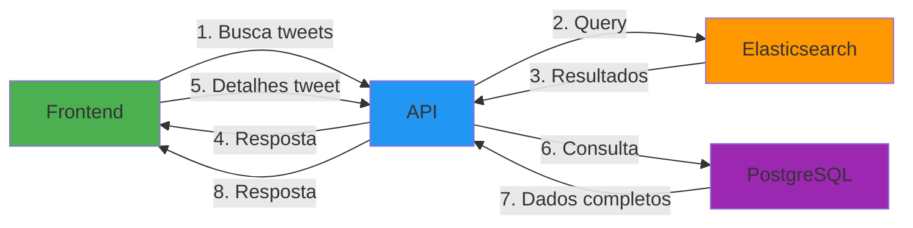

```mermaid
flowchart LR
    F[Frontend] -->|1. Busca tweets| A[API]
    A -->|2. Query| ES[Elasticsearch]
    ES -->|3. Resultados| A
    A -->|4. Resposta| F
    
    F -->|5. Detalhes tweet| A
    A -->|6. Consulta| DB[PostgreSQL]
    DB -->|7. Dados completos| A
    A -->|8. Resposta| F
    
    style F fill:#4CAF50
    style A fill:#2196F3
    style ES fill:#FF9800
    style DB fill:#9C27B0
```
