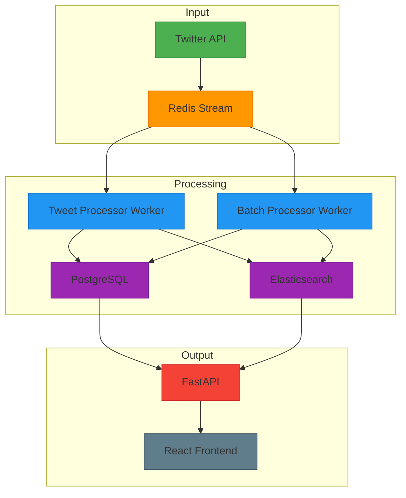

```mermaid
flowchart TD
    subgraph Input
        A[Twitter API] --> B[Redis Stream]
    end
    
    subgraph Processing
        B --> C[Tweet Processor Worker]
        B --> D[Batch Processor Worker]
        C --> E[PostgreSQL]
        C --> F[Elasticsearch]
        D --> E
        D --> F
    end
    
    subgraph Output
        E --> G[FastAPI]
        F --> G
        G --> H[React Frontend]
    end
    
    style A fill:#4CAF50,stroke:#388E3C
    style B fill:#FF9800,stroke:#F57C00
    style C fill:#2196F3,stroke:#1976D2
    style D fill:#2196F3,stroke:#1976D2
    style E fill:#9C27B0,stroke:#7B1FA2
    style F fill:#9C27B0,stroke:#7B1FA2
    style G fill:#F44336,stroke:#D32F2F
    style H fill:#607D8B,stroke:#455A64
```
