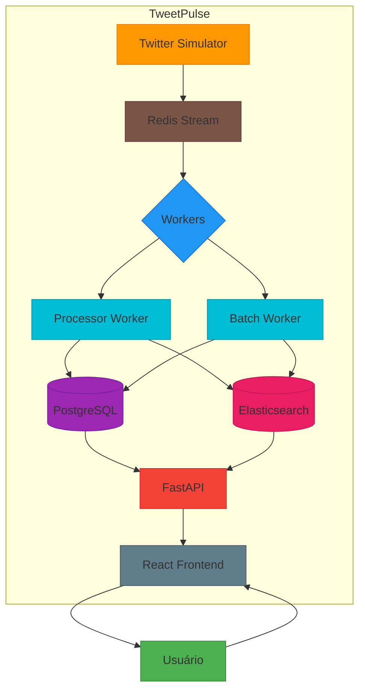

```mermaid
flowchart TD
    subgraph TweetPulse
        direction TB
        A[Twitter Simulator] --> B
        B[Redis Stream] --> C{Workers}
        C --> D[Processor Worker]
        C --> E[Batch Worker]
        D --> F[(PostgreSQL)]
        D --> G[(Elasticsearch)]
        E --> F
        E --> G
        F --> H[FastAPI]
        G --> H
        H --> I[React Frontend]
    end
    
    U[Usuário] --> I
    I --> U
    
    style U fill:#4CAF50,stroke:#388E3C
    style A fill:#FF9800,stroke:#F57C00
    style B fill:#795548,stroke:#5D4037
    style C fill:#2196F3,stroke:#1976D2
    style D fill:#00BCD4,stroke:#0097A7
    style E fill:#00BCD4,stroke:#0097A7
    style F fill:#9C27B0,stroke:#7B1FA2
    style G fill:#E91E63,stroke:#C2185B
    style H fill:#F44336,stroke:#D32F2F
    style I fill:#607D8B,stroke:#455A64
```
