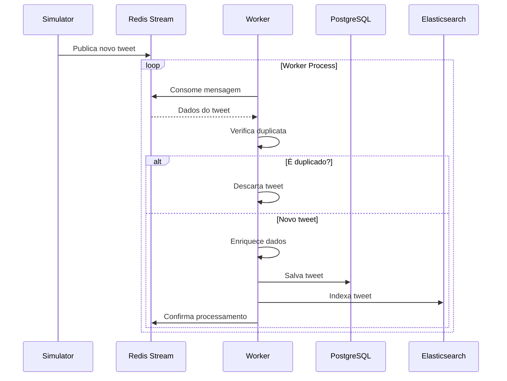

```mermaid
sequenceDiagram
    participant S as Simulator
    participant R as Redis Stream
    participant W as Worker
    participant DB as PostgreSQL
    participant ES as Elasticsearch
    
    S->>R: Publica novo tweet
    loop Worker Process
        W->>R: Consome mensagem
        R-->>W: Dados do tweet
        W->>W: Verifica duplicata
        alt É duplicado?
            W->>W: Descarta tweet
        else Novo tweet
            W->>W: Enriquece dados
            W->>DB: Salva tweet
            W->>ES: Indexa tweet
            W->>R: Confirma processamento
        end
    end
```
